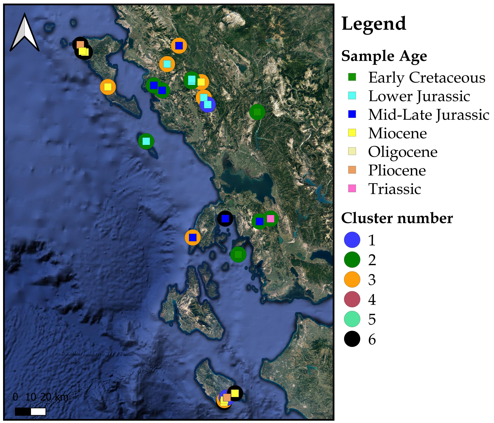

# A spectral approach for the clustering of source rocks.

This repository contains the official code for the conference paper "*A Novel Chemometric Approach for Oil & Source Rock Clustering*" presented at the [31<sup>st</sup> International Meeting on Organic Geochemistry (IMOG), 2023](https://eaog.org/https-imog-eaog-org/), and presented as a poster at the [13<sup>th</sup> FORTH Scientific Retreat, 2022](https://www.forth.gr/13th-forth-retreat/index.html). The paper can be found [here]( https://doi.org/10.3997/2214-4609.202333183), and the poster can be downloaded [here](Documents/Forth_Retreat_Poster.pdf).

<p align="center">
  
</p>
<center>
For this study we consider a set of 83 rock extracts from Western Greece’s potential source rocks. These samples are of multiple geological ages ranging from Triassic to Pliocene and are located in the so-called Ionian geotectonic zone of Greece.
</center>

### Motivation


Oil-oil and oil-source geochemical correlation is a subject of prime importance to the hydrocarbon exploration community for decades. So far, methods such as k-means, principal component analysis (PCA) and hierarchical clustering (HCA) have been extensively used in chemometrics for such problems. In this work, we present a **direct multiway spectral clustering** approach, which is a **graph based** method that allows the automatic selection of the **optimal number of clusters**.


### Normalized spectral clustering for source rocks

This repository implements a normalized spectral clustering algorithm for source rocks. We use  the relative amounts of n-alkanes and iso-prenoids in each sample as input data. The 
resulting clusters are based on the information contained in the eigenvectors of the random-walk graph Laplacian matrix, and the optimal number of clusters is determined by measuring the modularity of the constructed graph.
  
### Requirements
All the algorithms are implemented in MATLAB R2021b. The necessary paths are included in the script addpaths_Petrol.m

### Usage

The main script [`Run_SR_Clustering.m`](Run_SR_Clustering.m) runs the experiments on the input data, located at the [`/Input_Data`](Input_Data/) folder in .xlsx format.

**Data format**: In the excel input file columns 8:9 contain the latitude and longitude of the samples. Columns 12:end contain the peak areas of the n-alkanes, representative of the relative quantity of the compounds within each sample.

To run clustering on the available input data execute the command
```
>> Run_SR_Clustering
```

You will be promted in the command line to select the name of the input dataset,
```
Select name of dataset at Input_Data/:
```

and to select the method that determines the number of clusters:
```
1: Selection based on columns 
2: Select num of clusters manually 
3: Number of clusters based on modularity of resulting clusters 
Select method to determine # of clusters:
```
#### Code Structure

The structure of the files in this repository is as follows:
```
├── Auxilliary                  # auxilliary functions
├── Documents                   # paper & poster
├── Figures                     # our results
├── Final_Clustering            # clustering the Laplacian eigenvectors
├── Input_Data                  # source rock samples in .xlxs format
├── Metrics                     # evaluation of clustering results
├── PHA                         # hierarch. clustering as per Lu et. al. 2013
├── Results                     # folder to save new results
├── addpaths_Petrol.m           # add the necessary paths
├── Run_SR_Clustering.m         # main file, source rock clustering
```

Further details are documented within the code.

<!-- ### Acknowledgements
 -->

### Maintainers
- [Dimosthenis Pasadakis](https://dmspas.github.io/) ([dimosthenis.pasadakis@usi.ch](mailto:dimosthenis.pasadakis@usi.ch))

### References
To better understand the background behind this work, we recommend reading the following papers:
1. Peters, K., Walters, C., & Moldowan, J. (2004). Geochemical correlation and chemometrics. In The Biomarker Guide (pp. 475-482). Cambridge: Cambridge University Press.
2. White, S., & Smyth, P. (2005). A Spectral Clustering Approach To Finding Communities in Graphs. SIAM International Conference on Data Mining.
3. Pasadakis, D., Alappat, C., Schenk, O., & Wellein, G. (2022). Multiway p-Spectral Graph Cuts on Grassmann Manifolds. Mach. Learn., 111(2), 791–829.


### Citation

Please cite the following publication when using our software.
```
@article{mpp23,
   author = "Makri, V.I. and Pasadakis, D. and Pasadakis, N.",
   title = "A Novel Chemometric Approach for Oil \& Source Rock Clustering", 
   year = "2023",
   number = "1",
   pages = "1-2",
   doi = "https://doi.org/10.3997/2214-4609.202333183",
   url = "https://www.earthdoc.org/content/papers/10.3997/2214-4609.202333183",
   publisher = "European Association of Geoscientists &amp; Engineers",
   issn = "2214-4609",
  }
```
